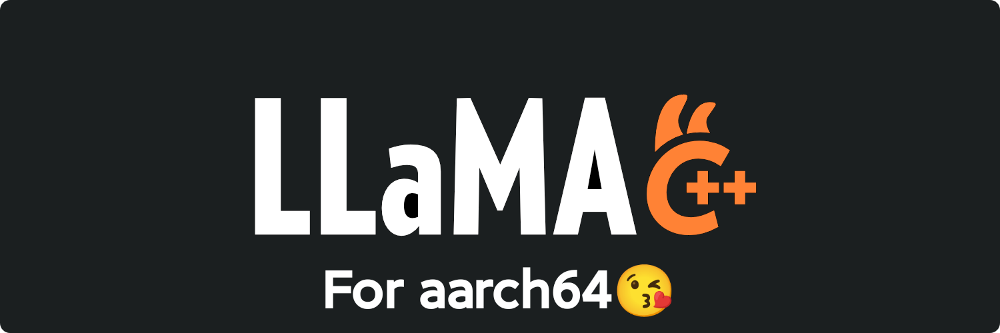
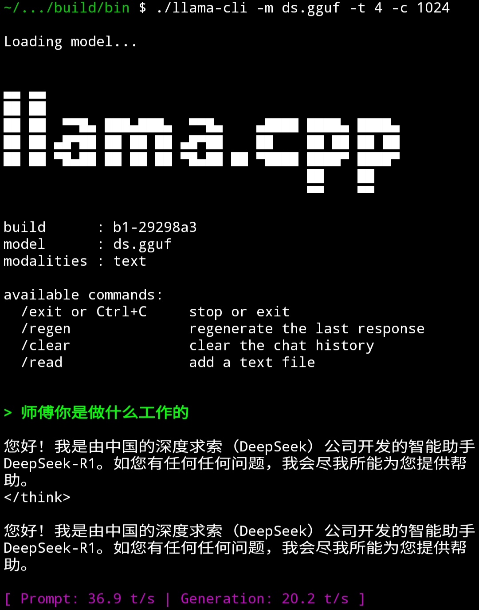

# llama.cpp for aarch64

In short, this repository is designed to make llama.cpp easily accessible for Android users, particularly those on Termux. It provides **optimized build scripts**, a sample Deepseek-R1 1.5b Model, along with source code and build files, saving you the hassle of navigating complex dependency hell and the expense of your valuable time.

This repository supports Vulkan banked on some SoCs.Please read the "Build on arm64" to check.



# Build on arm64
Navigate to the soc directory and find the script for your device’s SoC. Then, execute the corresponding script.

For example, if your SoC is a Dimensity 1000+, you should run soc/mediatek/dimensity-1000.sh. (Note: Scripts are typically named after the standard version of the SoC, omitting special edition suffixes like “+” or “Pro”.)

Currently Supported SoCs

| SoC | CPU Optimization | GPU Support | GPU Optimization |
| ---- | ---- | ---- | ---- |
| Dimensity1000(+) | √ | × | × |
| Snapdragon8(+) Gen1 | √ | √ | × |

# Usage
```bash
cd llama.cpp/
chmod +x ds.sh
./ds.sh
```

# Performance

SoC : Dimensity 1000+(8c@2.6Ghz)</br>
platform : CPU</br>
On average, it is 4 tokens/s(≈2 Chinese character/s) faster than the official Termux build.



[](https://github.com/ggml-org/llama.cpp/releases)
[](https://github.com/ggml-org/llama.cpp/actions/workflows/server.yml)
[](https://github.com/ggml-org/llama.cpp/actions/workflows/docker.yml)
[](https://github.com/ggml-org/llama.cpp/actions/workflows/winget.yml)

[manifesto](https://github.com/ggml-org/llama.cpp/discussions/205) / [ggml](https://github.com/ggml-org/ggml) / [ops](https://github.com/ggml-org/llama.cpp/blob/master/docs/ops.md) / [maintainer PRs](https://github.com/ggml-org/llama.cpp/issues?q=is%3Apr%20is%3Aopen%20draft%3AFalse%20(author%3Argerganov%20OR%20author%3AKitaitiMakoto%20OR%20author%3Adanbev%20OR%20author%3Aaldehir%20OR%20author%3Amax-krasnyansky%20OR%20author%3ACISC%20OR%20author%3Aggerganov%20OR%20author%3Aam17an%20OR%20author%3Abartowski1182%20OR%20author%3Ahipudding%20OR%20author%3AServeurpersoCom%20OR%20author%3Apwilkin%20OR%20author%3Areeselevine%20OR%20author%3Angxson%20OR%20author%3Ajeffbolznv%20OR%20author%3A0cc4m%20OR%20author%3Aangt%20OR%20author%3AIMbackK%20OR%20author%3Aarthw%20OR%20author%3AJohannesGaessler%20OR%20author%3AORippler%20OR%20author%3Aruixiang63%20OR%20author%3Axctan%20OR%20author%3Aallozaur%20OR%20author%3Ayomaytk%20OR%20author%3Aaendk%20OR%20author%3Agaugarg-nv%20OR%20author%3Ataronaeo%20OR%20author%3Aforforever73%20OR%20author%3Alhez%20OR%20author%3Anetrunnereve%20OR%20author%3Afairydreaming)%20sort%3Aupdated-desc) / [compile times](https://github.com/ggml-org/llama.cpp-dev/blob/master/README-compile-times.md) / [lib llama API](https://github.com/ggml-org/llama.cpp/issues/9289) / [llama-server REST API](https://github.com/ggml-org/llama.cpp/issues/9291)

</div>

## Quick start

A few options to get `llama.cpp` installed on your machine:

- Visit https://llama.app and follow the instructions
- Run with Docker - see our [Docker documentation](docs/docker.md)
- Download pre-built binaries from the [releases page](https://github.com/ggml-org/llama.cpp/releases)
- Build from source by cloning this repository - check out [our build guide](docs/build.md)

Once installed:

```sh
# Download and run a model directly from Hugging Face
llama cli -hf ggml-org/Qwen3.5-0.8B-GGUF

# Launch OpenAI-compatible API server
llama serve -hf ggml-org/Qwen3.5-0.8B-GGUF
```

<table align="center">
    <tr>
        <td align="center" width=50%>
            
            <i>VLM session with <b>llama cli</b></i>
        </td>
        <td align="center">
            
            <i>Built-in web UI against <b>llama serve</b></i>
        </td>
    </tr>
<table>

## Description

The main goal of `llama.cpp` is to enable LLM (and VLM) inference with minimal setup and state-of-the-art performance on
a wide range of hardware - locally and in the cloud.

- Plain C/C++ implementation without any dependencies
- Apple silicon is a first-class citizen - optimized via ARM NEON, Accelerate and Metal frameworks
- AVX, AVX2, AVX512 and AMX support for x86 architectures
- RVV, ZVFH, ZFH, ZICBOP and ZIHINTPAUSE support for RISC-V architectures
- 1.5-bit, 2-bit, 3-bit, 4-bit, 5-bit, 6-bit, and 8-bit integer quantization for faster inference and reduced memory use
- Custom CUDA kernels for running LLMs on NVIDIA GPUs (support for AMD GPUs via HIP and Moore Threads GPUs via MUSA)
- Vulkan and SYCL backend support
- CPU+GPU hybrid inference to partially accelerate models larger than the total VRAM capacity

The `llama.cpp` project is build on top of the [ggml](https://github.com/ggml-org/ggml) library.

## Supported backends

| Backend | Target devices |
| --- | --- |
| [BLAS](docs/build.md#blas-build) | All |
| [BLIS](docs/backend/BLIS.md) | All |
| [CANN](docs/build.md#cann) | Ascend NPU |
| [CUDA](docs/build.md#cuda) | Nvidia GPU |
| [HIP](docs/build.md#hip) | AMD GPU |
| [Hexagon [In Progress]](docs/backend/snapdragon/README.md) | Snapdragon |
| [IBM zDNN](docs/backend/zDNN.md) | IBM Z & LinuxONE |
| [MUSA](docs/build.md#musa) | Moore Threads GPU |
| [Metal](docs/build.md#metal-build) | Apple Silicon |
| [OpenCL](docs/backend/OPENCL.md) | Adreno GPU |
| [OpenVINO [In Progress]](docs/backend/OPENVINO.md) | Intel CPUs, GPUs, and NPUs |
| [RPC](https://github.com/ggml-org/llama.cpp/tree/master/tools/rpc) | All |
| [SYCL](docs/backend/SYCL.md) | Intel GPU |
| [VirtGPU](docs/backend/VirtGPU.md) | VirtGPU APIR |
| [Vulkan](docs/build.md#vulkan) | GPU |
| [WebGPU](docs/build.md#webgpu) | All |
| [ZenDNN](docs/build.md#zendnn) | AMD CPU |

## Documentation

#### Tools

- [cli](tools/cli/README.md)
- [completion](tools/completion/README.md)
- [server](tools/server/README.md)
- [GBNF grammars](grammars/README.md)

#### Development

- [How to build](docs/build.md)
- [Running on Docker](docs/docker.md)
- [Build on Android](docs/android.md)
- [Multi-GPU usage](docs/multi-gpu.md)
- [Performance troubleshooting](docs/development/token_generation_performance_tips.md)
- [GGML tips & tricks](https://github.com/ggml-org/llama.cpp/wiki/GGML-Tips-&-Tricks)
- [XCFramework](docs/xcframework.md)
- [Completions](docs/completions.md)
- [Models](docs/models.md)
- [Release process](docs/release.md)

## Contributing

- Contributors can open PRs
- Collaborators will be invited based on contributions
- Maintainers can push to branches in the `llama.cpp` repo and merge PRs into the `master` branch
- Any help with managing issues, PRs and projects is very appreciated!
- Read the [CONTRIBUTING.md](CONTRIBUTING.md) for more information

## Acknowledgements

- [yhirose/cpp-httplib](https://github.com/yhirose/cpp-httplib) - Single-header HTTP server, used by `llama-server` - MIT license
- [nothings/stb](https://github.com/nothings/stb) - Single-header image format decoder, used by multimodal subsystem - Public domain
- [nlohmann/json](https://github.com/nlohmann/json) - Single-header JSON library, used by various tools/examples - MIT License
- [mackron/miniaudio](https://github.com/mackron/miniaudio) - Single-header audio format decoder, used by multimodal subsystem - Public domain
- [sheredom/subprocess.h](https://github.com/sheredom/subprocess.h) - Single-header process launching solution for C and C++ - Public domain
